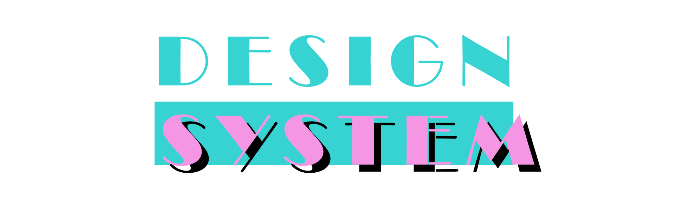

items: [],

A baseline style for React apps that use css-in-js. Essentially just a wrapper around [styled-system](https://github.com/jxnblk/styled-system) with some extras.

## Getting Started

Install into any React project.

```
yarn add d10m
```

## Usage

`d10m` is the simplest take on a design system that can be extended within any react project that uses css-in-js.

It can also be used without css-in-js, if you're just looking for a simple styling implementation.

```javascript
import React from "react"
import { render } from "react-dom"
import { ThemeProvider } from "d10m"

import "./theme"

const App = () => <h1>hello world</h1>

render(
  <ThemeProvider theme={theme}>
    <App />
  </ThemeProvider>,
  document.getElementById("root")
)
```

### Components

**Global**

`d10m` comes with a global 'normalizer', which is based off of [normalize.css](https://github.com/necolas/normalize.css), [sanitize.css](https://github.com/jonathantneal/sanitize.css/), and [html5-bp](https://github.com/h5bp/html5-boilerplate). this normalizer is wrapped into the `ThemeProvider` component.

**ThemeProvider**

Comes with a minimal [default theme](https://github.com/gretzky/d10m/blob/master/src/theme/defaultTheme.js), or you can supply your own. Create a `theme.js` file that exports an object, and then add the ThemeProvider component to the root of your app (see example above).

**Layout**

`<Wrapper>` - a base wrapper container for the body of an app, with margin/padding/width.

`<Media>` - a component for responsivity if necessary. see [react-media](https://github.com/ReactTraining/react-media)

`<Flex>` - a flexbox component. see [grid-styled](https://github.com/jxnblk/)

`<Box>` - a style-prop ready div. see [grid-styled](https://github.com/jxnblk/)

## Related / Shoutouts

Shoutout [brent jackson](https://github.com/jxnblk)

* [styled-system](https://github.com/jxnblk/styled-system)
* [grid-styled](https://github.com/jxnblk/grid-styled)
